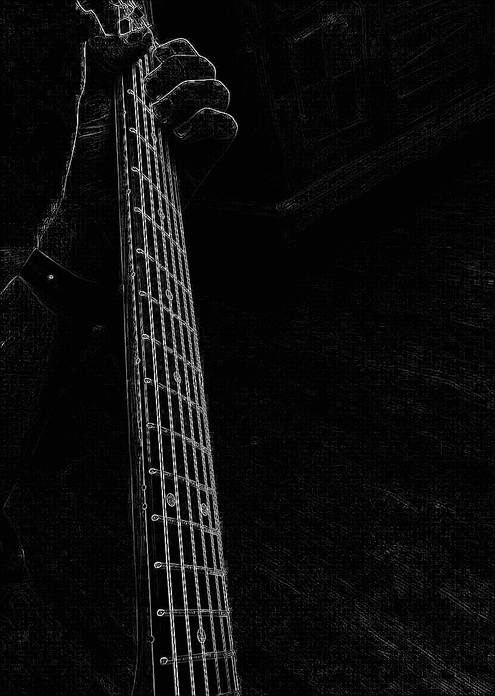
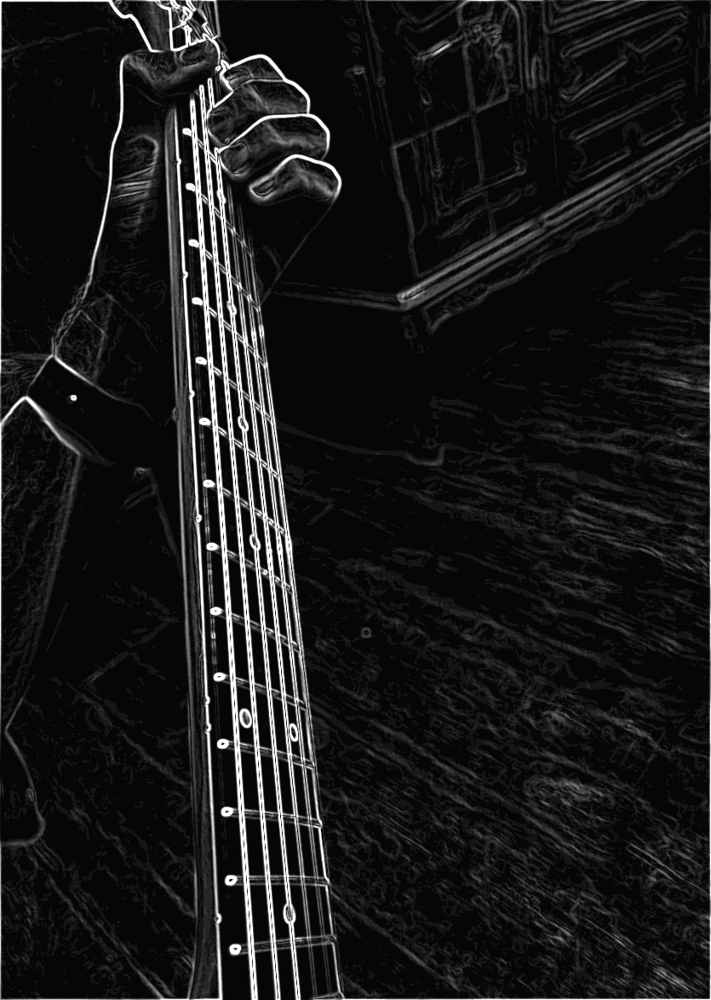
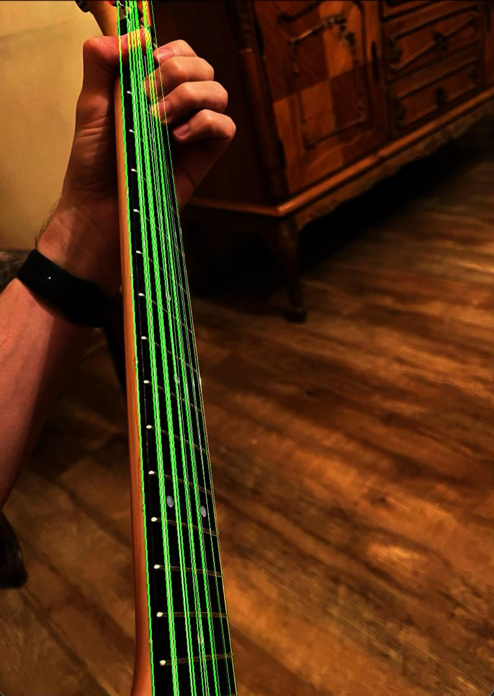

# Metalhead

Metalhead is a Swift framework that provides high-performance graphics and computation capabilities using Metal, Apple's graphics and compute API. This framework is designed to simplify working with Metal while providing powerful abstractions for common graphics and computation tasks.
It works with static images or videos as well as with stream from camera feed

## Features

- **Metal Integration**: Seamless integration with Apple's Metal framework for high-performance graphics and compute operations
- **Image Processing**: Comprehensive support for image manipulation and processing
- **Matrix Operations**: Advanced matrix computation capabilities
- **Metal Shaders**: Built-in shader support with customization options
- **Combine Integration**: Modern async/await and Combine support for reactive programming
- **Extensive Extensions**: Rich set of extensions for common types and operations

## Usage Examples

### Laplasian Operator for edge detection

### Sobel Operator for edge detection

### Hough Transform for detecting lines as math functions from given image or video stream

